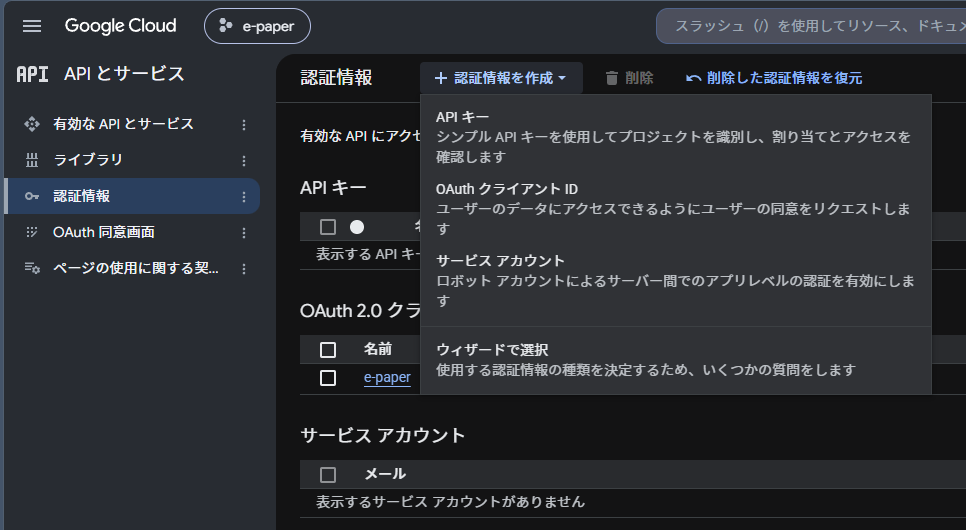

## awesome-epaper

Waveshare 7.5inch e-paper Bにカレンダーや写真を表示させるリポジトリ

Raspberry Pi上でFastAPIサーバを動かし、適当なブラウザでアクセスするとダッシュボードが表示されます。

calendar/image/test/clearの4モードから選んでdraw!ボタンを押下すると、その場で描画と実機表示まで行います

描画するたびに結果のプレビューPNGが `src/img/image.png` に同じファイル名で上書き保存されるためデバッグに有効

実行環境は raspberrypi 3b で検証、開発環境は適当なlinux環境ですが、e-paperに描画することができないので環境変数で対応しました。詳しくは後述

raspberrypi zero w でも動作検証予定

```
src/
├── waveshare_epd/        # Waveshare純正ドライバ
├── clear.py              # e-paperを白紙に戻す手動ユーティリティ
├── main.py               # FastAPIアプリ
├── google_auth_setup.py  # 初回のみのOAuth認証
├── epd_7in5b_V2_test.py  # テストコード
├── secret.py.example     # secret.pyのひな形
├── static/index.html     # ダッシュボード
├── pic/                  # epd_7in5b_V2_test.pyが使うフォントと写真
├── img/                  # プレビューPNGの書き出し先
└── lib/                  # 描画エンジン・データ取得まわり
    ├── draw.py              # 800x480の黒面/赤面キャンバスへの描画エンジン
    ├── draw_calendar.py     # カレンダー画面の組み立て
    ├── google_calendar.py   # Googleカレンダーからの予定取得
    ├── google_tasks.py      # Google Tasksからのタスク取得
    ├── google_auth.py       # Calendar/Tasks共通のOAuth2認証情報ロード・更新・永続化
    ├── epd_backend.py       # EPD_MODEで実機/開発モックを切り替えるEPD生成
    ├── requestAPI.py        # 祝日API等の汎用GETヘルパー
    └── misakifont/          # 日本語ビットマップフォント
```


## env

https://www.waveshare.com/pico-epaper-7.5-b.htm


必要に応じて以下のリポジトリからドライバー置き換えてください

https://github.com/waveshareteam/e-Paper/tree/master/RaspberryPi_JetsonNano/python/lib/waveshare_epd


画像サイズとかも多分変わっちゃうけど、変更してみて


## raspberry pi setup

### 1. venv

```bash
cd ~/epaper
python -m venv .venv
source .venv/bin/activate
```

### 2. install

`spidev`はCコンパイルが必要なので、先にビルド環境を入れる、開発時は不要

```bash
sudo apt install -y python3-dev build-essential swig
pip install -r requirements-hardware.txt
```

`requirements.txt` は開発ホストと実機の共通のライブラリ

実機でe-paperに実際に描画するには、追加でハードウェア制御ライブラリのインストール`requirements_hardware.txt`が必要で、開発時は不要

```bash
pip install -r requirements.txt

# prod
pip install -r requirements-hardware.txt
```

### 3. SPI

開発時は不要

```bash
sudo raspi-config
```
`Interface Options -> SPI -> Enable`

有効化後は一度再起動しておくと確実です

```bash
sudo reboot
```

### 4. lgpio install

開発時は不要

gpiozeroはデフォルトだとlgpio/RPi.GPIO/pigpioで不安定になることがあるのでlgpioを入れて解消

`liblgpio`本体はpipでは入らないので、ソースからビルドする

```bash
cd ~
git clone https://github.com/joan2937/lg.git
cd lg
make
sudo make install
sudo ldconfig
```

ワーニングかエラー出るけど、まあ大丈夫


### 5. e-paper 確認

```bash
cd ~/epaper
python src/epd_7in5b_V2_test.py
```

https://github.com/waveshareteam/e-Paper/tree/master/RaspberryPi_JetsonNano/python/lib/waveshare_epd

./src/waveshare_epd を必要に応じて↑のリポジトリから変更してください。 epdconfig.py はそのままでも大丈夫だと思う、配線ちゃんとしていれば

gpio対応は↓にまとめてます

https://nishima-tech.com/article/pico-epaper/


### 6. Google Calendar / Tasks 連携の準備

OAuth2でブラウザのあの認証を通してリフレッシュトークンとかが書かれた `token.json` を入手する必要がある

#### 6-1. GCP側の準備

1. GCP ConsoleでCalendar APIとTasks APIの両方を有効化
2. APIとサービス -> 認証情報 -> 認証情報を作成 -> OAuthクライアントID -> デスクトップ アプリ を選択して作成
3. 発行されたクライアントシークレットJSONをダウンロードし、`src/`に配置



ファイル名は任意、`secret.py`で指定


#### 6-2. secret.pyの準備

```bash
cd ~/epaper/src
cp secret.py.example secret.py
```

`secret.py` を編集し、`GOOGLE_OAUTH_CLIENT_SECRET_FILE`（ダウンロードしたJSONのファイル名）と `GOOGLE_CALENDAERID`（カレンダーID）を実際の値に書き換える

https://calendar.google.com/calendar/u/0/r/settings

カレンダーIDはGoogleカレンダーの設定を開き、左にあるマイカレンダーをクリック、下に行くとあります

デフォルトのカレンダーは自分のgmailのアドレスそのままです


#### 6-3. 初回認証

ヘッドレスの場合はSSHのポートフォワードで、GUIがある場合は表示されるリンクをブラウザで開きます


**ヘッドレスの場合：**SSHクライアントからポートフォワーディングでラズパイにSSH接続する。ポート番号は43211
```bash
ssh -L 43211:localhost:43211 <user>@<Piのアドレス>
```


```bash
cd ~/epaper
source .venv/bin/activate
cd src
python google_auth_setup.py
```

コンソールに表示されるURLをブラウザで開き、Googleの同意画面を通す

ブラウザは`http://localhost:43211/...`にリダイレクト、スクリプトが自動的に検知し`src/lib/token.json`を生成して終了する。

以降のサーバ起動時はこのファイルから自動的に認証情報を読み込む。ブラウザ操作は不要、

`token.json`の中身が失効・取り消しされた場合は`google_auth_setup.py`を再実行すること


### 7. サーバを起動する

```bash
cd ~/epaper
source .venv/bin/activate
uvicorn main:app --app-dir src --host 0.0.0.0 --port 8000

# dev
EPD_MODE=mock uvicorn main:app --app-dir src
```

ポートとかhostは適当に


#### 開発用の実行環境 EPD_MODE

`main.py`は環境変数`EPD_MODE`でe-paperへの出力先を切り替える。FastAPIエンドポイント・描画ロジックのコア自体はどちらのモードでも同じで、最後にハードウェアへ実際に描画するかどうかが変わる

`EPD_MODE`を省略するとハードウェア制御まで行う、開発ホストの場合はエラー出るよ


## エンドポイント

- `GET /` — ダッシュボード`src/static/index.html` calendar/image/test/clearの4モード
- `GET /draw` — カレンダーを再描画し、そのまま実機のe-paperに表示する
- `POST /draw/clear` — e-paperを白紙にクリアする（`src/clear.py`と同じ処理）。
- `POST /draw/test` — `src/epd_7in5b_V2_test.py`を実行する、 https://github.com/waveshareteam/e-Paper/tree/master/RaspberryPi_JetsonNano/python/examples
- `POST /draw/image` — アップロードされた画像を800x480に切り抜き・リサイズして実機に表示する、`multipart/form-data`、フィールド名`file`
- `GET /calendar` — 描画結果を黒面/赤面のバイト列として返す、廃止予定

`/draw`系エンドポイントはいずれも呼ぶたびに `src/img/image.png` にプレビュー画像を同じファイル名で上書き保存する


## contact
`contact@nishima-tech.com`


---
ps. このリポジトリは以下のリポジトリを継承・統合しています

https://github.com/mitsuiJao/e-paper-server

https://github.com/mitsuiJao/e-paper-client
